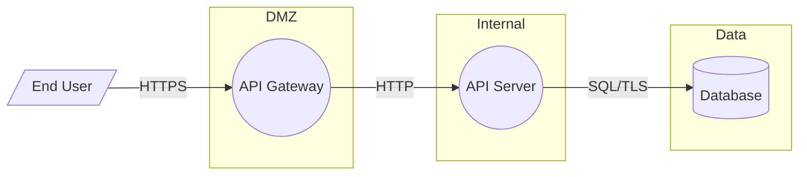

# Randori (乱取り) — PASTA Threat Modeling Plugin for Claude Code

AI-powered threat modeling implementing the full PASTA (Process for Attack Simulation and Threat Analysis) methodology. STRIDE classification, MITRE ATT&CK mapping, data flow diagrams, attack trees, and evidence-anchored threat scenarios — all from your source code.

Most teams skip threat modeling because it feels academic. Randori makes it a 10-minute conversation: type `/randori:pasta`, and Claude walks through all 7 PASTA stages, reads your code, builds DFDs, identifies threats with STRIDE, maps to ATT&CK techniques, and produces attack trees.

## What You Get

- **7 PASTA stages** (S1-S4 free, S5-S7 pro)
- **STRIDE threat classification** with code evidence
- **MITRE ATT&CK technique mapping** (T-codes)
- **Data flow diagrams** in Mermaid format
- **Attack tree generation** with AND/OR decomposition
- **5-factor probabilistic risk assessment** (VerSprite model)
- **OWASP Top 10 cross-reference**
- **CAPEC pattern mapping**
- **Resume support** — pick up where you left off

## Installation

```bash
claude mcp add-plugin randori-plugin --path /path/to/randori-plugin
```

Or clone and add manually:

```bash
git clone https://github.com/allsmog/randori-plugin.git
```

Then add to your Claude Code settings:

```json
{
  "plugins": ["/path/to/randori-plugin"]
}
```

## Quick Start

```
# Full PASTA threat model (stages 1-4)
/randori:pasta

# Individual stages
/randori:s1    # Define business objectives
/randori:s2    # Map technical scope
/randori:s3    # Decompose app + generate DFD
/randori:s4    # Threat analysis (STRIDE + ATT&CK)

# Generate report from completed stages
/randori:threat-report
```

## Commands

| Command | Description | Free |
|---------|-------------|------|
| `/randori:pasta` | Full PASTA run (all available stages) | S1-S4 |
| `/randori:s1` | Stage 1: Define business objectives | Yes |
| `/randori:s2` | Stage 2: Technical scope | Yes |
| `/randori:s3` | Stage 3: App decomposition + DFD | Yes |
| `/randori:s4` | Stage 4: Threat analysis (STRIDE) | Yes |
| `/randori:s5` | Stage 5: Vulnerability analysis | Pro |
| `/randori:s6` | Stage 6: Attack modeling | Pro |
| `/randori:s7` | Stage 7: Risk management | Pro |
| `/randori:threat-report` | Generate report | Yes |

### pasta flags

| Flag | Effect |
|------|--------|
| `--stages s1,s2,s3,s4` | Run specific stages only |
| `--format json\|md\|mermaid` | Output format |
| `--resume` | Resume from previous incomplete analysis |

## The 7 PASTA Stages

```
S1 Define Objectives     → Business context, risk profile
    ↓
S2 Technical Scope       → Components, actors, services
    ↓
S3 Decomposition         → DFD, trust boundaries, entry points
    ↓
S4 Threat Analysis       → STRIDE threats, ATT&CK, attack trees
    ↓
S5 Vulnerability Analysis → CVE/CWE correlation (Pro)
    ↓
S6 Attack Modeling       → Full attack trees, simulation (Pro)
    ↓
S7 Risk Management       → Mitigations, residual risk (Pro)
```

### Free Tier (S1-S4)

Provides a complete foundational threat model:
- Business and security objectives
- Full technical scope inventory
- Data flow diagram with trust boundaries
- STRIDE-classified threat scenarios with code evidence
- MITRE ATT&CK technique mapping
- 5-factor probabilistic assessment
- Draft attack trees

### Pro Tier (S5-S7)

Adds deep analysis via the Randori API:
- CVE/CWE correlation (NVD, OSV, EPSS, CISA KEV)
- Full attack trees with probability propagation
- Attack simulation with step-by-step paths
- Residual risk analysis
- Mitigation strategies with effort estimates
- Compliance-mapped recommendations

## Agents

| Agent | Role | Used In |
|-------|------|---------|
| **threat-analyst** | STRIDE threats + ATT&CK mapping | S4 |
| **attack-modeler** | Attack trees + attack surface | S4, S6 |
| **risk-assessor** | Probabilistic risk scoring | S4, S7 |
| **vuln-correlator** | CVE/CWE correlation | S5 |

## Skills

| Skill | Description |
|-------|-------------|
| **STRIDE Classification** | Complete STRIDE reference with code patterns, ATT&CK mappings, and CWE cross-references |
| **PASTA Methodology** | Full 7-stage methodology reference with inputs, outputs, and dependencies |
| **MITRE ATT&CK Mapping** | Enterprise technique reference organized by tactic |
| **Attack Tree Generation** | AND/OR tree construction with VerSprite node roles and probability propagation |
| **DFD Generation** | Data flow diagram creation in Mermaid format with trust zones |

## Output

### Threat scenarios

Every threat includes:

```
[TS-001] Brute-force authentication bypass
- STRIDE: Spoofing
- ATT&CK: T1110 (Brute Force)
- OWASP: A07 (Auth Failures)
- Evidence: src/routes/auth.ts:45 — No rate limiting on login
- Probability: 0.72 (5-factor assessment)
- Impact: High
```

### Data Flow Diagrams

Mermaid DFDs saved to `.claude/dfd.mmd`:



### Attack Trees

AND/OR attack trees with probability propagation:

```
Goal: Steal User Data (P=0.52)
├── [OR] SQL Injection Path (P=0.52)
│   ├── [AND] Discover endpoint (P=0.8)
│   └── [AND] Extract data (P=0.65)
└── [OR] Credential Theft (P=0.17)
    ├── [AND] Brute-force (P=0.6)
    ├── [AND] Escalate (P=0.4)
    └── [AND] Export (P=0.7)
```

### State files

- `.claude/randori-state.json` — Machine-readable state
- `.claude/threat-model.md` — Full threat model report
- `.claude/dfd.mmd` — Mermaid DFD
- `.claude/pasta-s{1-7}.json` — Per-stage outputs

## STRIDE + ATT&CK Quick Reference

| STRIDE | Security Property | ATT&CK Techniques |
|--------|------------------|-------------------|
| **S**poofing | Authentication | T1078, T1110, T1539 |
| **T**ampering | Integrity | T1059, T1190, T1565 |
| **R**epudiation | Non-repudiation | T1070, T1036 |
| **I**nfo Disclosure | Confidentiality | T1552, T1005, T1567 |
| **D**enial of Service | Availability | T1498, T1499 |
| **E**levation of Privilege | Authorization | T1068, T1548 |

## Pro Mode

Community edition covers PASTA stages 1-4 (free, open source).

**Pro mode** (coming soon) adds:
- Stages 5-7 (vulnerability analysis, attack modeling, risk management)
- Threat intelligence (NVD, CISA KEV, EPSS, OSV)
- Full attack trees with simulation
- Compliance-mapped recommendations
- PDF/HTML reports

To configure Pro mode, create `.claude/randori.local.md`:

```yaml
---
randori_api_key: your-api-key-here
---
```

## Limitations

- Threat modeling quality depends on codebase size and structure. Small, well-organized codebases produce better results.
- The threat model is **advisory** — it should be reviewed by security professionals and discussed with stakeholders.
- ATT&CK and OWASP mappings are based on pattern matching, not formal verification.
- Community mode (S1-S4) uses Claude's built-in knowledge. Pro mode (S5-S7) adds real-time threat intelligence.

## License

MIT
