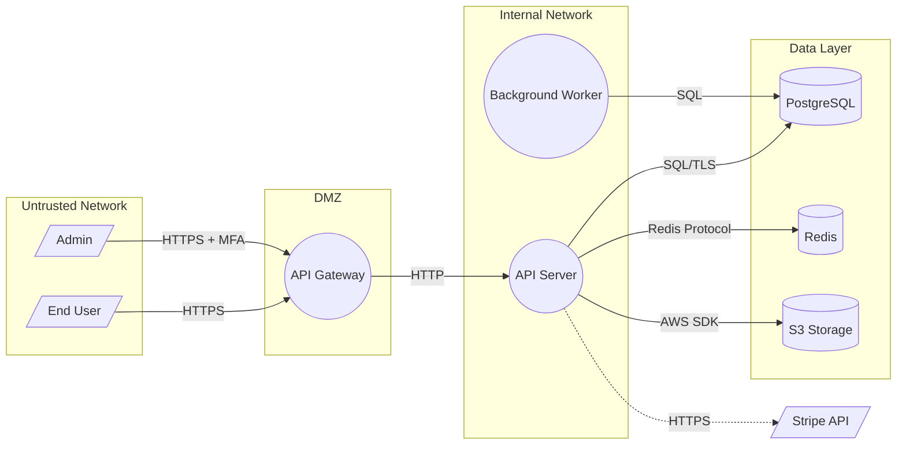

# Stage 3: Application Decomposition

Build a data flow diagram (DFD), identify trust boundaries, enumerate entry points, and construct an access control matrix.

## Prerequisites

Stages 1 and 2 must be completed. Check for `.claude/pasta-s2.json`.

## Process

### Step 1: Build Data Flow Diagram (DFD)

Using the components, actors, and data flows from S2, construct a DFD:

1. **Map external entities** — actors from S2 (users, admins, external systems)
2. **Map processes** — services and application components from S2
3. **Map data stores** — databases, caches, file storage from S2
4. **Draw data flows** — connections between entities, processes, and stores

Read actual code to trace how data flows:

```bash
# Route definitions (entry points for data)
grep -rniE "(app\.(get|post|put|patch|delete)|router\.(get|post|put|patch|delete)|@(Get|Post|Put|Delete|Patch))" --include="*.ts" --include="*.js" --include="*.py" --include="*.go" --include="*.java"

# Database operations (data sinks)
grep -rniE "(\.find|\.query|\.create|\.insert|\.update|\.delete|\.save|SELECT|INSERT|UPDATE|DELETE)" --include="*.ts" --include="*.js" --include="*.py" --include="*.go" --include="*.java"

# External API calls (cross-boundary flows)
grep -rniE "(fetch\(|axios\.|requests\.(get|post)|http\.(Get|Post)|HttpClient)" --include="*.ts" --include="*.js" --include="*.py" --include="*.go" --include="*.java"
```

### Step 2: Identify trust boundaries

Trust boundaries separate zones with different security postures:

- **Untrusted → DMZ**: Internet to load balancer/API gateway
- **DMZ → Internal**: API gateway to application services
- **Internal → Data**: Application to database/storage
- **Internal → External**: Application to third-party APIs

For each boundary, identify:
- **Inner zone**: The more trusted side
- **Outer zone**: The less trusted side
- **Crossing flows**: Which data flows cross this boundary?

### Step 3: Enumerate entry points

List every point where data enters the application:

```bash
# All API routes
grep -rniE "^\s*(app|router)\.(get|post|put|patch|delete)\s*\(" --include="*.ts" --include="*.js"
grep -rniE "@(Get|Post|Put|Patch|Delete)\s*\(" --include="*.ts" --include="*.java"
grep -rniE "@app\.(route|get|post|put|patch|delete)" --include="*.py"
grep -rniE "func.*Handler|func.*http\.Handler" --include="*.go"
```

For each entry point, classify:
- **Type**: api-endpoint | web-form | file-upload | message-queue | database-connection | cli
- **Trust level**: untrusted | partially-trusted | trusted | highly-trusted
- **Data classification**: What data does it handle?

### Step 4: Build access control matrix

Map actors to resources/operations:

Read authorization code:

```bash
# Middleware and guards
grep -rniE "(middleware|guard|authorize|hasRole|canAccess|permission)" --include="*.ts" --include="*.js" --include="*.py" --include="*.go" --include="*.java"

# Route-level auth
grep -rniE "(requireAuth|isAuthenticated|protect|restrict)" --include="*.ts" --include="*.js" --include="*.py" --include="*.go"
```

### Step 5: Security functional analysis

For each trust boundary, assess:
- **Authentication mechanism**: What auth protects this boundary?
- **Authorization model**: RBAC, ABAC, ACL?
- **Encryption in transit**: TLS? Which version?
- **Encryption at rest**: Encrypted database? Encrypted storage?
- **Input validation**: Validated at this boundary?
- **Logging coverage**: full | partial | none

### Step 6: Generate Mermaid DFD

Write a Mermaid flowchart diagram to `.claude/dfd.mmd`:



**Legend**:
- `[/ /]` = External entity
- `(( ))` = Process
- `[( )]` = Data store
- `-->` = Data flow
- `-.->` = Trust boundary crossing
- Subgraphs = Trust zones

## Output

```markdown
# PASTA Stage 3: Application Decomposition

## Data Flow Diagram
See `.claude/dfd.mmd` for the Mermaid diagram.

## Trust Boundaries
| ID | Name | Inner Zone | Outer Zone | Crossing Flows |
|----|------|-----------|------------|----------------|
| TB-001 | Internet boundary | DMZ | Untrusted | User→Gateway, Admin→Gateway |
| TB-002 | App boundary | Internal | DMZ | Gateway→API |
| TB-003 | Data boundary | Data Layer | Internal | API→DB, API→Cache |

## Entry Points
| ID | Name | Type | Trust Level | Data Classification |
|----|------|------|------------|---------------------|
| EP-001 | POST /api/auth/login | api-endpoint | untrusted | credentials |
| EP-002 | POST /api/users | api-endpoint | untrusted | PII |
| EP-003 | POST /api/upload | file-upload | untrusted | user files |
| EP-004 | POST /webhooks/stripe | api-endpoint | partially-trusted | payment data |

## Access Control Matrix
| Actor | /api/users | /api/admin | /api/billing | /api/upload |
|-------|-----------|-----------|-------------|-------------|
| End User | read own | none | read own | write |
| Admin | full | full | full | full |
| API Consumer | read | none | none | none |

## Security Functional Analysis
| Trust Boundary | Auth | Authz | Encryption Transit | Encryption Rest | Validation | Logging |
|---------------|------|-------|--------------------|-----------------|------------|---------|
| Internet→DMZ | JWT | N/A | TLS 1.3 | N/A | N/A | partial |
| DMZ→Internal | Internal | RBAC | HTTP | N/A | Yes | full |
| Internal→Data | N/A | N/A | TLS | AES-256 | N/A | partial |

## Use Cases
| ID | Name | Actors | Security Relevance |
|----|------|--------|-------------------|
| UC-001 | User registration | End User | high — PII submission |
| UC-002 | Payment processing | End User, Stripe | critical — financial data |
| UC-003 | Admin user management | Admin | high — privilege operations |
```

**You MUST save the above structured output to `.claude/pasta-s3.json` AND the Mermaid DFD to `.claude/dfd.mmd` before this stage is considered complete.** Use `mkdir -p .claude && cat > .claude/<file> << 'EOF'` via Bash for each file. These files are required by downstream stages and for resume support.
