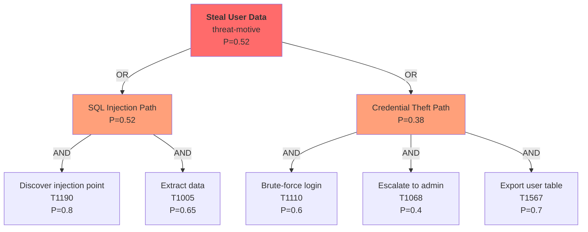

# Attack Tree Construction

## Purpose

Build structured AND/OR attack trees that decompose high-level threat goals into concrete, actionable attack steps aligned with the VerSprite model.

## When to Use

- During PASTA Stage 4 (draft attack trees)
- During PASTA Stage 6 (complete attack trees)
- When analyzing multi-step attack scenarios
- When visualizing attack paths for stakeholders

## Tree Structure

### Node Types

| Type | Symbol | Meaning | Probability Rule |
|------|--------|---------|-----------------|
| AND | All children required | Attacker must complete ALL sub-steps | P = P(child1) * P(child2) * ... |
| OR | Any child sufficient | Attacker can use ANY sub-path | P = max(P(child1), P(child2), ...) |
| LEAF | Terminal step | Concrete technique, no decomposition | P from 5-factor model |

### Node Roles (VerSprite Alignment)

| Level | Role | Description | Example |
|-------|------|-------------|---------|
| 0 | threat-motive | Root: attacker's goal | "Steal payment card data" |
| 1 | threat-agent | Who performs the attack | "External attacker (financially motivated)" |
| 2 | target | What is being attacked | "Payment API, card database" |
| 3 | attack-vector | Delivery mechanism | "Network access, social engineering" |
| 4 | attack-pattern | Specific CAPEC pattern | "CAPEC-66: SQL Injection" |

## Construction Process

### Step 1: Define the root (threat-motive)
Start with the threat scenario goal from STRIDE analysis.

### Step 2: Identify threat agents (level 1)
Who would pursue this goal? Multiple agents = OR node (any agent can attack).

### Step 3: Map targets (level 2)
What components must be compromised? Multiple sequential targets = AND node.

### Step 4: Enumerate attack vectors (level 3)
How can each target be reached? Multiple vectors = OR node (alternative paths).

### Step 5: Decompose to attack patterns (level 4)
What specific technique is used? Reference ATT&CK T-codes and CAPEC patterns.

## Mermaid Diagram Format

### Probability Calculation

For the SQL Injection path (AND):
- P = 0.8 * 0.65 = **0.52**

For the Credential Theft path (AND):
- P = 0.6 * 0.4 * 0.7 = **0.168** ≈ 0.17

Root (OR): P = max(0.52, 0.17) = **0.52**

## Depth Limits

- Maximum 10 levels (prevent infinite decomposition)
- Each LEAF must reference a specific ATT&CK technique or CAPEC pattern
- Each LEAF should have a code evidence anchor where possible

## Quality Checklist

- [ ] Root node clearly states the attacker's goal
- [ ] AND/OR logic is correct at each level
- [ ] Probability propagation follows the rules
- [ ] Every LEAF has an ATT&CK technique reference
- [ ] Critical paths (highest probability) are highlighted
- [ ] Detection opportunities are noted at each step
