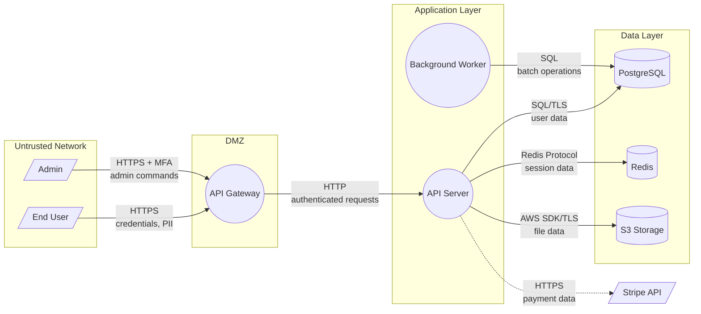

# Data Flow Diagram Generation

## Purpose

Create Mermaid-compatible data flow diagrams (DFDs) that visualize how data moves through a system, crossing trust boundaries between components.

## When to Use

- During PASTA Stage 3 (decomposition)
- When visualizing application architecture for threat modeling
- When identifying trust boundaries
- When communicating data flows to stakeholders

## DFD Element Types

| Element | Mermaid Syntax | Description |
|---------|---------------|-------------|
| External Entity | `[/ Name /]` | Actor outside the system boundary (user, API consumer, external service) |
| Process | `(( Name ))` | Application component that transforms data |
| Data Store | `[( Name )]` | Database, cache, file storage, or queue |
| Data Flow | `-->` or `-.->` | Data movement between elements |
| Trust Zone | `subgraph "Zone Name"` | Security boundary grouping |

## Trust Boundary Crossings

Data flows that cross trust boundaries are the primary targets for threat analysis:

- `-->` = Normal data flow (within same trust zone)
- `-.->` = Trust boundary crossing (different trust zones — HIGHER PRIORITY for threats)

## Standard Trust Zones

| Zone | Trust Level | Examples |
|------|-------------|---------|
| Untrusted | None | Internet, public APIs, user browsers |
| DMZ | Low | Load balancers, API gateways, reverse proxies |
| Application | Medium | Application servers, microservices |
| Data | High | Databases, caches, internal storage |
| Management | Highest | Admin interfaces, CI/CD, secret vaults |

## Construction Process

### Step 1: Identify all elements

From the technical scope (S2):
- External entities = actors (users, admins, external services)
- Processes = application components (API server, worker, gateway)
- Data stores = databases, caches, file storage, message queues

### Step 2: Group by trust zone

Assign each element to a trust zone based on:
- Network location (public vs internal)
- Authentication requirements
- Data sensitivity handled

### Step 3: Map data flows

For each pair of connected elements:
- What data flows between them?
- What protocol is used?
- Does the flow cross a trust boundary?
- What data classification applies?

### Step 4: Generate Mermaid diagram



## Key Principles

1. **Every trust boundary crossing is a threat opportunity** — focus STRIDE analysis here
2. **Label data flows with protocol and data type** — helps identify encryption gaps
3. **Show both directions** — request and response flows may have different security properties
4. **Keep it readable** — max ~15-20 elements per diagram. For complex systems, create multiple DFDs by subsystem
5. **Include external services** — third-party APIs, SaaS services, cloud providers

## Common Patterns

### Web Application
```
User → [HTTPS] → Load Balancer → [HTTP] → App Server → [SQL/TLS] → Database
```

### Microservices
```
API Gateway → [gRPC/mTLS] → Service A → [AMQP] → Queue → Service B → [SQL] → DB
```

### Serverless
```
API Gateway → [Invoke] → Lambda → [SDK] → DynamoDB
                                 → [SDK] → S3
                                 → [HTTPS] → External API
```
